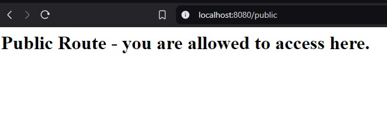
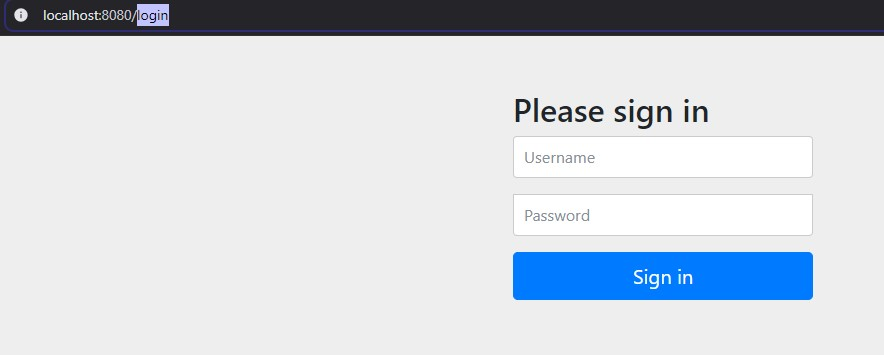
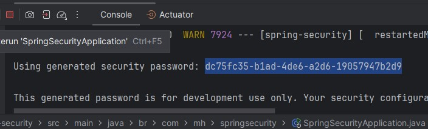
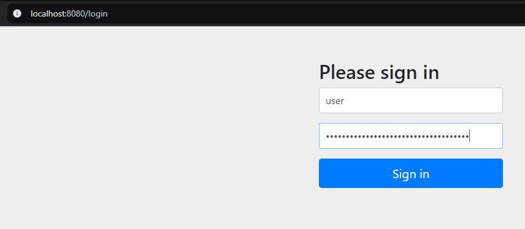
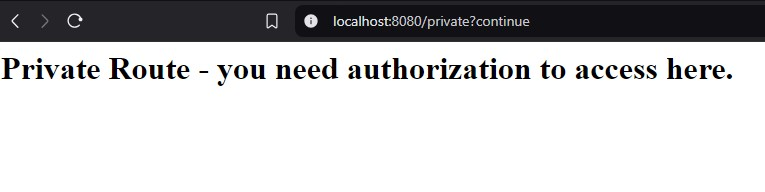

# Spring Security
- Projeto desenvolvido a partir [desse vídeo](https://www.youtube.com/watch?v=EQ5EwIYsgIE), com o propósito de entender e implementar os mecanismos de acesso utlizados numa API.
- Processo de criação do projeto foi documentado via commits e  `README.md` a fim de:
    - Fixar os conhecimentos
    - Execitar o uso do Git
## Tópicos
- Autenticação
- Segurança de Rotas
- Uso do OAuth 2.0 utilizando o acesso com o Google Accounts
- Uso do JWT no Resource Server

## Roteiro do Projeto
- [x] Criação de um projeto base sem implementação de segurança
- [x] Adição do Spring Security e Proteção Automática
- [ ] Configuração da segurança para as rotas
- [ ] Autenticando no Google com Oauth 2.0
- [ ] Autenticação com JWT

### 1 - Criação do Projeto
- Implementação de uma rota pública sem autenticação
```
@GetMapping("/public")
String publicRoute(){
  return """
          <h1>Public Route - you are allowed to access here.</h1>
          """;
}
```
- Acesso a rota pública



- Implementação de uma rota privada ainda sem autenticação
```
@GetMapping("/private")
String privateRoute(){
    return """
            <h1>Private Route - you need authorization to access here.</h1>
            """;
}
```
### 2 - Adição do Spring Security
- Adicionado a dependência do Spring Security
```
<dependency>
    <groupId>org.springframework.boot</groupId>
    <artifactId>spring-boot-starter-security</artifactId>
</dependency>
<dependency>
    <groupId>org.springframework.security</groupId>
    <artifactId>spring-security-test</artifactId>
    <scope>test</scope>
</dependency>
```

- Foi atribuida automaticamente uma proteção às rotas de acesso



- O Spring Security fornece um usuário e senha padrões para acessar as rotas




- Acesso com as credenciais do Spring Security


